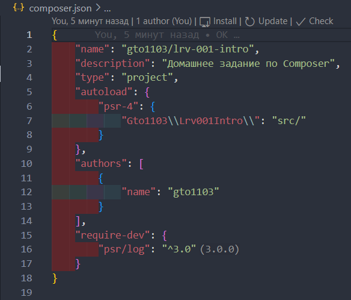
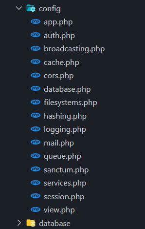

# Задание 2. Установка composer

Вам необходимо установить и настроить окружение для composer-проекта, используя инструкцию из первого задания:

- Должно быть указано Ваше имя в качестве автора пакета и в названии пакета в качестве поставщика
- В описании должно быть указано "Домашнее задание по Composer"
- Остальные поля указывать на своё усмотрение из возможных вариантов.

После этого установите в `dev`-зависимости пакет `psr/log`.

В качестве решения пришлите MD-файл с кодом/скриншотом созданного файла `composer.json`.



## Дополнительное задание (со звёздочкой)

Это задание является необязательным и необходимо только для более глубокого понимания материала:

Ответьте на следующие вопросы:

- В чем разница между файлами `composer.json` и `composer.lock` ?
- В чем разница между директивами `require-dev` и `require` внутри файла `composer.json`?
- В чем разница между запуском команды `composer install` и `composer update`?

# Задание 3. Установка Laravel

## Требования

- В домашнем задании должна быть использовать последняя актуальная (на момент выполнения) версия фреймворка.

## Предыстория

В предыдущем задании вы настроили окружение и установили composer, теперь время начать работать с Laravel
и положить первый кирпичик в свое приложение :)

## Техническое задание

Учимся создавать проект с нуля.

**Обратите внимание:** Вы должны развернуть последнюю актуальную версию фреймворка Laravel.

### Порядок действий

1. Установите Laravel (инструкции вы найдете в первом задании) и создайте свой проект;
2. Настройте стандартный файл конфигурации `.env.example` (обратите внимание, что это файл настроек по умолчанию из которого создаётся файл переменных окружения `.env`);
   - установите соответствующее название проекта в `APP_NAME`;
   - установить окружение в режим отладки (позже мы изучим, как работает эта панель) в `APP_DEBUG`;
3. Изучите структуру созданного проекта (инструкции и описания также есть в первом задании);
4. Запустите проект с помощью **php artisan serve**, чтобы по http://localhost:8000 отдавалась дефолтная страница проекта.

### Ответьте на вопросы

1. Перечислите список composer-пакетов, которые использует фреймворк Laravel после установки.

Они храняться в файле composer.json.

```json
{
"name": "laravel/laravel",
"type": "project",
"description": "The skeleton application for the Laravel framework.",
"keywords": ["laravel", "framework"],
"license": "MIT",
"require": {
"php": "^8.1",
"guzzlehttp/guzzle": "^7.2",
"laravel/framework": "^10.10",
"laravel/sanctum": "^3.2",
"laravel/tinker": "^2.8"
},
"require-dev": {
"fakerphp/faker": "^1.9.1",
"laravel/pint": "^1.0",
"laravel/sail": "^1.18",
"mockery/mockery": "^1.4.4",
"nunomaduro/collision": "^7.0",
"phpunit/phpunit": "^10.1",
"spatie/laravel-ignition": "^2.0"
},
"autoload": {
"psr-4": {
"App\\": "app/",
"Database\\Factories\\": "database/factories/",
"Database\\Seeders\\": "database/seeders/"
}
},
"autoload-dev": {
"psr-4": {
"Tests\\": "tests/"
}
},
"scripts": {
"post-autoload-dump": [
"Illuminate\\Foundation\\ComposerScripts::postAutoloadDump",
"@php artisan package:discover --ansi"
],
"post-update-cmd": [
"@php artisan vendor:publish --tag=laravel-assets --ansi --force"
],
"post-root-package-install": [
"@php -r \"file_exists('.env') || copy('.env.example', '.env');\""
],
"post-create-project-cmd": [
"@php artisan key:generate --ansi"
]
},
"extra": {
"laravel": {
"dont-discover": []
}
},
"config": {
"optimize-autoloader": true,
"preferred-install": "dist",
"sort-packages": true,
"allow-plugins": {
"pestphp/pest-plugin": true,
"php-http/discovery": true
}
},
"minimum-stability": "stable",
"prefer-stable": true
}
```

2. Изучите директорию `config` и опишите какие файлы хранятся в этой директории.

В этой директории хранятся файлы настроек приложения.



3. В какой директории хранятся основные файлы (классы) с бизнес-логикой приложения?

Они хранятся в директории "арр". В основном в папке "Models".
